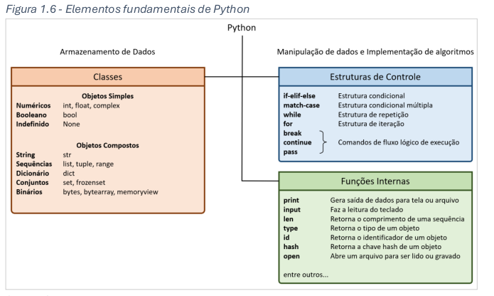
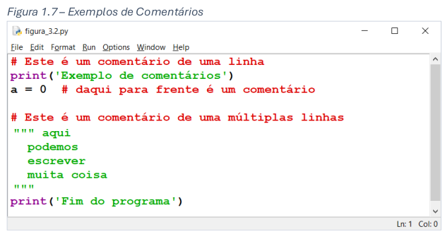

# 17/10/2024 - CURSO DE PYTHON FATEC HUAWEI - DAY 1

## Introdução

## 1.1 A Linguagem Python

Python foi criada no início dos anos 1990 por Guido van Rossum e lançada em 1991. Hoje, é mantida e desenvolvida pela Python Software Foundation, uma organização sem fins lucrativos criada em 2001. Python é uma linguagem simples e intuitiva, mas ao mesmo tempo poderosa e robusta, o que a torna ideal tanto para estudantes quanto para profissionais.

### Principais Características de Python

### Portabilidade
Python e suas bibliotecas padrão estão disponíveis em várias plataformas, como Unix, Linux, Windows e Mac OS. Um programa escrito em Python que utiliza apenas as bibliotecas padrão será executado da mesma maneira em qualquer plataforma.

### Código Livre (Opensource)
Python é escrito em C e é disponibilizado como software livre. Isso permite que programadores desenvolvam e distribuam software sem custos, além de poderem baixar, modificar e utilizar o código, conforme os termos de sua licença.

### Simplicidade com Robustez
A sintaxe de Python é simples, elegante e legível, mas também poderosa. Com um núcleo enxuto e coerente, ela permite o desenvolvimento de grandes projetos, incluindo aplicações orientadas a objetos, sistemas multimídia, e integração com outras linguagens.

### Grande Aplicabilidade
Python pode ser usada em diversas áreas, como:
- Administração de sistemas operacionais
- Big Data e bancos de dados SQL e NoSQL
- Aplicações gráficas e multimídia
- Análise de dados
- Machine Learning e Inteligência Artificial
- Programação web
- Desenvolvimento de software para áreas científicas e específicas, como estatística, engenharia e biologia.

### Versões da Linguagem Python

Python possui duas versões principais: Python 2 e Python 3. Embora compartilhem muitos elementos, Python 3 introduziu mudanças significativas que quebraram a compatibilidade com Python 2. Lançada em 2008, a versão 3 foi inicialmente adotada lentamente devido à grande base de código existente em Python 2. No entanto, após campanhas incentivando a migração, Python 3 tornou-se majoritariamente usada. O suporte a Python 2 foi oficialmente encerrado em 20 de abril de 2020 com o lançamento da última versão, 2.7.18.

Neste material, apenas elementos de Python 3 serão abordados.

## 1.2 Instalação

- https://www.python.org/downloads/

## 1.3 Ambiente de desenvolvimento

## 1.4 Documentação

- https://docs.python.org/3

## 1.5 Requisitos minimos para rodar python

- Programas escritos em linguagem Python não exigem grandes capacidades computacionais. Um
computador antigo com processador i3 das primeiras gerações com 2 Gbytes de memória consegue rodar
programas Python

## 1.6 Elementos Fundamentais de Python

## 1.7 Comentários

# 16/10/2024 - CURSO DE PYTHON FATEC HUAWEI - DAY 2

# Capitulo 2: Classes e Objetos

## 1.1 Armazenamento de dados

## 1.2 Classes e objetos em python

## 1.3 Objetos de classe simples

# 18/10/2024 - CURSO DE PYTHON FATEC HUAWEI - DAY 3
