# 27/01/25 - CURSO DE PYTHON FATEC HUAWEI - DAY 1

## Capitulo 1: Introdução 

### 1.1 Instalação

- https://www.python.org/downloads/

### 1.2 Ambiente de desenvolvimento

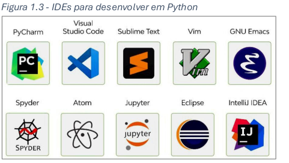

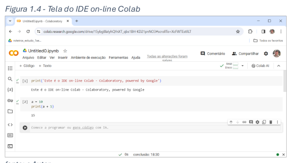

### 1.3  Tutorial de Instalação e Utilização Básica do PyCharm Community Edition

---
**Introdução**
O PyCharm é uma das IDEs mais populares para desenvolvimento em Python, oferecendo uma série de recursos que facilitam o desenvolvimento, depuração e teste de aplicações. A versão **Community Edition** é gratuita e atende a maioria das necessidades de desenvolvedores iniciantes e intermediários.
---

**Pré-requisitos**
- **Sistema Operacional**: Windows, macOS ou Linux.
- **Python**: Certifique-se de que o Python está instalado em seu sistema. Você pode baixá-lo em [python.org](https://www.python.org/downloads/).

**1. Baixar o PyCharm**
1. Acesse o site oficial do PyCharm: [JetBrains PyCharm](https://www.jetbrains.com/pycharm/download/).
2. Escolha a versão **Community** e faça o download correspondente ao seu sistema operacional.

**2. Instalar no Windows**
1. Execute o instalador baixado (`pycharm-community-<versão>.exe`).
2. Siga os passos do assistente de instalação:
   - Escolha o diretório de instalação.
   - Opcionalmente, marque:
     - Criar um atalho na área de trabalho.
     - Associar arquivos `.py` ao PyCharm.
3. Clique em **Instalar** e aguarde a conclusão.
4. Após a instalação, abra o PyCharm e finalize a configuração inicial.

**3. Instalar no macOS**
1. Abra o arquivo `.dmg` baixado.
2. Arraste o ícone do PyCharm para a pasta **Aplicativos**.
3. Abra o PyCharm pela primeira vez e permita a execução caso apareça um aviso de segurança.

**4. Instalar no Linux**
1. Extraia o arquivo `.tar.gz` baixado:
   ```bash
   tar -xzf pycharm-community-<versão>.tar.gz
   ```
2. Navegue até o diretório extraído:
   ```bash
   cd pycharm-community-<versão>/bin
   ```
3. Execute o PyCharm:
   ```bash
   ./pycharm.sh
   ```
---

**Primeiros Passos no PyCharm**

**1. Configuração Inicial**
1. Ao abrir o PyCharm pela primeira vez:
   - Escolha um tema (claro ou escuro).
   - Configure plug-ins adicionais (opcional).
   - Clique em **Start Using PyCharm**.

**2. Criar um Novo Projeto**
1. Na tela inicial, clique em **New Project**.
2. Escolha um local para o projeto no seu sistema.
3. Selecione o interpretador Python:
   - Clique em **Add Interpreter**.
   - Escolha **System Interpreter** e selecione a versão do Python instalada.
4. Clique em **Create**.

**3. Escrever e Executar Código**
1. Clique com o botão direito no diretório principal do projeto e selecione **New > Python File**.
2. Nomeie o arquivo (ex.: `hello_world.py`).
3. Escreva seu código no editor. Exemplo:
   ```python
      print("Hello, PyCharm!")
   ```
4. Para executar o código:
   - Clique com o botão direito no editor e selecione **Run 'hello_world'**.
   - Ou pressione **Shift + F10**.

---

**Recursos Básicos**

**1. Autocompletar Código**
O PyCharm sugere automaticamente métodos, variáveis e funções enquanto você digita.

**2. Depuração**
1. Coloque um **breakpoint** clicando à esquerda da linha de código.
2. Execute o script em modo de depuração:
   - Clique no ícone de **bug** ou pressione **Shift + F9**.
3. Inspecione valores e fluxos de execução.

**3. Gerenciamento de Pacotes**
1. Abra o menu **File > Settings**.
2. Vá até **Project > Python Interpreter**.
3. Clique no botão **+** para instalar novos pacotes, como:
   ```bash
   pip install nome_do_pacote
   ```
---

**Conclusão**
O PyCharm Community Edition é uma ferramenta poderosa para quem deseja trabalhar com Python. Sua interface intuitiva e recursos avançados ajudam a aumentar a produtividade, mesmo para iniciantes. Explore seus recursos e torne o desenvolvimento mais eficiente! 

---

**Referências**
- [Documentação Oficial do PyCharm](https://www.jetbrains.com/pycharm/documentation/)


### 1.4 Teste do Capitulo 1

## Capítulo 2: Classes e objetos

## 2.1 Armazenamento de dados

- Em programação de computadores uma variável é um elemento da linguagem que ocupa um ou mais
bytes na memória do computador. Esse local da memória é capaz de reter, ou seja, armazenar um valor. No
programa, a variável é identificada por um nome ou identificador. Desta forma podemos entender que "do
ponto de vista" do programador a variável é um nome que contém um valor; e "do ponto de vista" do
computador a variável é um endereço de memória que retém um conjunto de bits que representam esse
valor.
- Na primeira linha quando fazemos qtde = 2 o valor 2 está sendo atribuído ao nome qtde. Assim,
dizemos que qtde é a variável e 2 é o seu conteúdo.

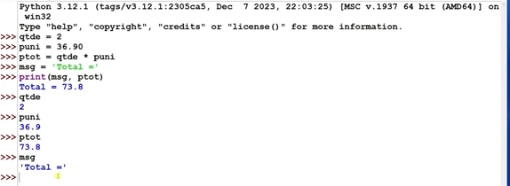

# 28/01/25 - CURSO DE PYTHON FATEC HUAWEI - DAY 2

## 2.2 Classes e objetos em python

- **Classe** é um modelo que define como um objeto é construído. A classe é codificada no
programa e fica à disposição do programador para a ser usada no momento em que for
necessário criar um objeto;

- **Objeto** é construído a partir de uma classe. Ele é real, ocupa memória e consome tempo de
processamento do computador;

- **Atributos** personaliza o objeto, tornando-o específico para uma determinada aplicação.

- **Métodos** são as funcionalidades de um objeto. Eles atuam sobre os atributos e permitem a execução de ações como entrada e saída de dados (atributos), validações de dados, cálculos, acesso a
banco de dados, etc.

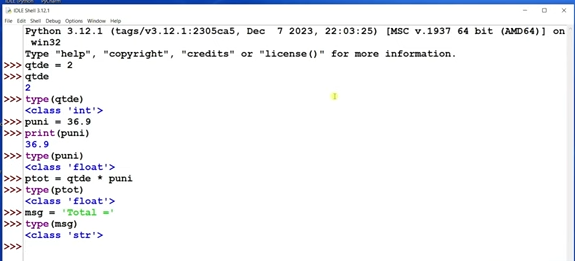


## 2.3 Objetos de classe simples

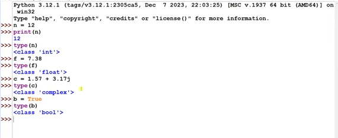

## 2.4 Comandos e atributos

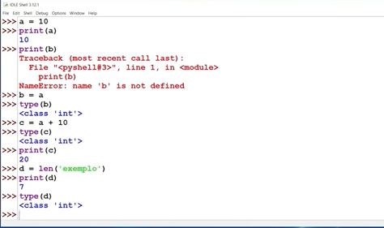

## 2.5 Id dos objetos Python Parte I

- Em Python, o ID de um objeto é um número inteiro único que identifica cada objeto durante sua existência no programa. Esse identificador, ou "ID", pode ser obtido usando a função id(objeto), onde objeto é a variável ou o objeto do qual queremos o ID.

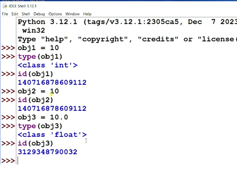

- objetos com os mesmos valores e mesma classe serão apontados para o mesmo id.
- Objetos com o mesmo valor podem ou não compartilhar o mesmo ID, dependendo do tipo de objeto e da implementação.
- Para tipos imutáveis (como inteiros, strings pequenas e tuplas), Python pode reutilizar o mesmo espaço na memória para otimizar o desempenho e economizar recursos. Por exemplo:

```python

a = 10
b = 10
print(id(a) == id(b))  # True, pois Python reaproveita o mesmo valor imutável.
```

- Para objetos mutáveis (como listas ou dicionários), cada instância terá um ID diferente, mesmo que os valores sejam idênticos.


## 2.6 Id dos objetos Python Parte II

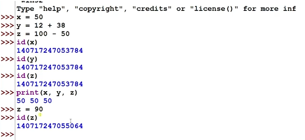

# 29/01/25 - CURSO DE PYTHON FATEC HUAWEI - DAY 

## 2.7 Modelo de dados de Python

# Modelo de Dados em Python

O modelo de dados de Python define como os dados são representados e manipulados na linguagem. Ele descreve como as operações, a memória e os tipos de dados são tratados internamente. Abaixo estão os principais aspectos do modelo de dados de Python.

## 1. **Objetos e Identidade**
   - Em Python, *tudo é um objeto*, incluindo tipos básicos como inteiros e strings.
   - Cada objeto possui um **ID** único, que identifica sua localização na memória durante sua existência. O ID pode ser obtido com `id(objeto)`.

## 2. **Tipos e Classes**
   - Python possui tipos embutidos como `int`, `float`, `str`, `list`, `dict`, e muitos mais.
   - Classes permitem a criação de tipos personalizados. Cada tipo é uma instância da classe `type`.
   - Os tipos são divididos em **imutáveis** (não podem ser alterados, como `int` e `tuple`) e **mutáveis** (podem ser alterados, como `list` e `dict`).

## 3. **Atributos e Métodos**
   - Objetos possuem **atributos** e **métodos** (funções que operam sobre os objetos).
   - É possível acessar os atributos e métodos com a sintaxe `objeto.atributo`.

## 4. **Protocolo de Sequência e Mapeamento**
   - Python permite a manipulação de coleções como **sequências** (`list`, `tuple`, `str`) e **mapeamentos** (`dict`).
   - Sequências suportam operações como indexação (`obj[i]`), fatiamento (`obj[start:stop]`) e iteração.

## 5. **Protocolo de Iteração**
   - O protocolo de iteração permite percorrer coleções de dados. Todo objeto que implementa o método `__iter__()` é um **iterável**.
   - Iteradores são obtidos com a função `iter(objeto)` e iteram com o método `__next__()`.

## 6. **Sobrecarga de Operadores**
   - Python permite a sobrecarga de operadores como `+`, `-`, `*`, etc., usando métodos especiais (`__add__`, `__sub__`, etc.) definidos nas classes.
   - Isso permite personalizar como objetos interagem com esses operadores.

## 7. **Gerenciamento de Memória e Coleta de Lixo**
   - Python gerencia a memória automaticamente usando **contagem de referências** e um **coletor de lixo** para liberar objetos que não estão mais em uso.

## 8. **Protocolo de Contexto**
   - O protocolo de contexto é usado para gerenciar recursos, como arquivos, de forma segura, usando a sintaxe `with`. A classe deve implementar os métodos `__enter__()` e `__exit__()`.

O modelo de dados em Python é flexível e extensível, permitindo manipulação avançada de objetos e controle detalhado sobre o comportamento dos dados.

- No exemplo acima, uma Pessoa tem um Endereco, formando um relacionamento que organiza os dados de forma estruturada.

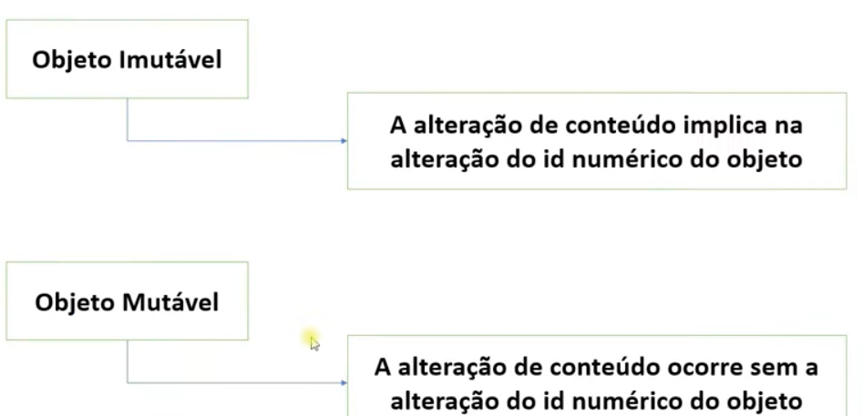


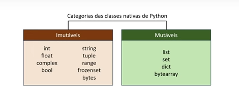

## 2.8 Operadores aritmeticos

| Operador        | Símbolo | Exemplo          | Descrição                                     |
|-----------------|---------|------------------|-----------------------------------------------|
| Adição          | `+`     | `a + b`          | Soma os valores de `a` e `b`.                 |
| Subtração       | `-`     | `a - b`          | Subtrai o valor de `b` do valor de `a`.       |
| Multiplicação   | `*`     | `a * b`          | Multiplica `a` por `b`.                       |
| Divisão         | `/`     | `a / b`          | Divide `a` por `b` e retorna um `float`.      |
| Divisão Inteira | `//`    | `a // b`         | Divide `a` por `b` e retorna a parte inteira. |
| Módulo          | `%`     | `a % b`          | Retorna o resto da divisão de `a` por `b`.    |
| Exponenciação   | `**`    | `a ** b`         | Eleva `a` à potência `b`.                     |
| Negação         | `-`     | `-a`             | Inverte o sinal de `a`.                       |

```python
a = 10
b = 3

print(a + b)   # 13
print(a - b)   # 7
print(a * b)   # 30
print(a / b)   # 3.3333...
print(a // b)  # 3
print(a % b)   # 1
print(a ** b)  # 1000
print(-a)      # -10

```

## 2.9 Comandos de atribuição incremental

- Os comandos de atribuição incremental em Python são usados para atualizar o valor de uma variável de maneira mais concisa. Eles combinam um operador aritmético ou bitwise com o operador de atribuição (=), permitindo modificar a variável sem precisar reescrevê-la completamente.

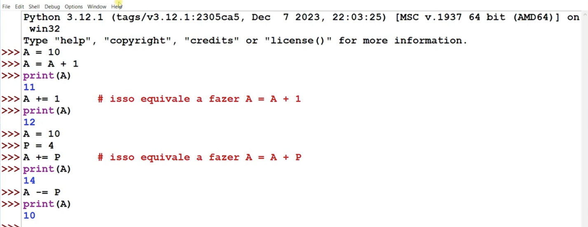

| Operação         | Operador | Exemplo    | Explicação do Exemplo à esquerda          | Resultado esperado |
|----------------|----------|-----------|---------------------------------|------------------|
| Adição         | `+`      | `C = A + B`  | Soma de A com B               | `19`             |
| Subtração      | `-`      | `C = A - B`  | Subtrai B de A                | `9`              |
| Multiplicação  | `*`      | `C = A * B`  | Multiplica A por B            | `70`             |
| Divisão       | `/`      | `C = A / B`  | Divide A por B, gerando um resultado real | `2.8`            |
| Divisão inteira | `//`     | `C = A // B` | Divide A por B, gerando um resultado inteiro | `2`              |
| Resto (módulo) | `%`      | `C = A % B`  | Calcula o resto da divisão de A por B | `4`              |
| Menos unário   | `-`      | `C = -A`    | Negativa o valor de A         | `-14`            |
| Potenciação    | `**`     | `C = A ** B` | Eleva A por B                 | `537824`         |

## 2.10 Funções matemáticas

- Python fornece diversas funções matemáticas embutidas e no módulo `math`. Abaixo estão algumas das principais:

### **Funções Matemáticas Embutidas**

| Função         | Descrição                                  | Exemplo                    |
|---------------|--------------------------------|----------------------------|
| `abs(x)`     | Retorna o valor absoluto de `x` | `abs(-5) -> 5` |
| `round(x, n)` | Arredonda `x` para `n` casas decimais | `round(3.14159, 2) -> 3.14` |
| `pow(x, y)`  | Retorna `x` elevado a `y` | `pow(2, 3) -> 8` |
| `max(a, b, c, ...)` | Retorna o maior valor | `max(3, 7, 2) -> 7` |
| `min(a, b, c, ...)` | Retorna o menor valor | `min(3, 7, 2) -> 2` |

### **Funções do Módulo `math`**

Para utilizar essas funções, é necessário importar o módulo `math`:

```python
import math

```

| Função          | Descrição | Pertence a |
|----------------|------------------------------------------------------|--------------|
| `abs(x)`      | Valor absoluto (módulo) de `x` | Biblioteca Padrão |
| `int(x)`      | Converte `x` para inteiro eliminando sua parte decimal. O conteúdo de `x` deve ser real | Biblioteca Padrão |
| `float(x)`    | Converte `x` para número real. O conteúdo de `x` deve ser inteiro | Biblioteca Padrão |
| `round(x[, n])` | Arredonda `x` com `n` dígitos decimais. Se `n` for omitido, o valor `0` é assumido | Biblioteca Padrão |
| `trunc(x)`    | O valor `x` é truncado, ou seja, a parte decimal é eliminada. Na prática, equivale a `int(x)` | Biblioteca `math` |
| `floor(x)`    | Retorna o maior inteiro `≤ x` | Biblioteca `math` |
| `ceil(x)`     | Retorna o menor inteiro `≥ x` | Biblioteca `math` |
| `sqrt(x)`     | Calcula a raiz quadrada de `x` | Bibliotecas `math` e `cmath` |
| `exp(x)`      | Retorna o exponencial de `x`, ou seja, `e^x` | Bibliotecas `math` e `cmath` |
| `log(x[, base])` | Retorna o logaritmo de `x` na base fornecida. Se a base for omitida, calcula o logaritmo natural | Bibliotecas `math` e `cmath` |
| `sin(x)`      | Retorna o seno do ângulo `x` em radianos | Bibliotecas `math` e `cmath` |
| `cos(x)`      | Retorna o cosseno do ângulo `x` em radianos | Bibliotecas `math` e `cmath` |
| `tan(x)`      | Retorna a tangente do ângulo `x` em radianos | Bibliotecas `math` e `cmath` |
| `rect(r, phi)` | Converte um número complexo expresso em coordenadas polares para sua representação retangular | Biblioteca `cmath` |
| `polar(x)`    | Retorna a representação do argumento `x` expresso em coordenadas polares. Retorna uma tupla `(r, phi)`, em que `r` é o módulo e `phi` é a fase | Biblioteca `cmath` |


## 2.11 Teste Capitulo 2


